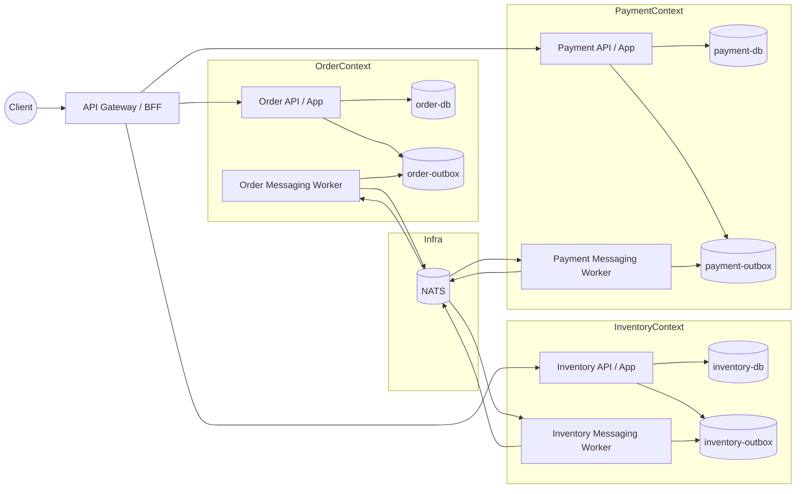
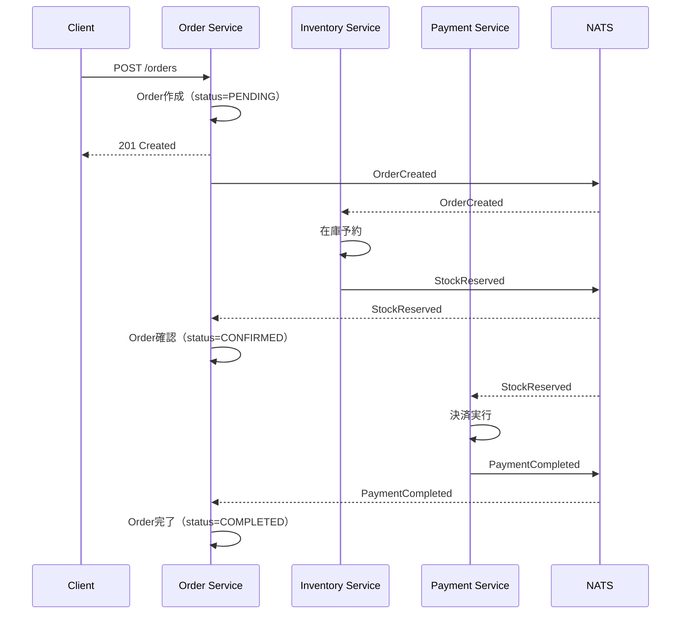
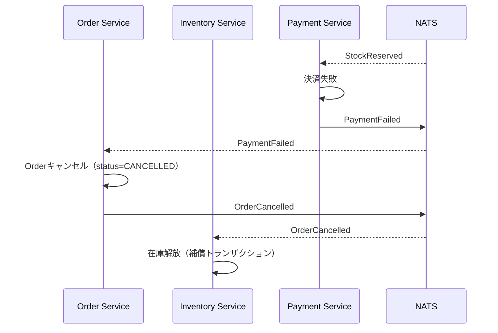

# マイクロサービスアーキテクチャ サンプル

Sagaパターンと補償トランザクションを実装したマイクロサービスアーキテクチャのサンプルプロジェクトです。

## 概要

このプロジェクトは、注文、在庫、決済の3つのサービスで構成されるECシステムのバックエンドを模したサンプル実装です。サービス間の連携にはイベント駆動アーキテクチャを採用し、Sagaパターンによる最終的整合性を実現しています。

## アーキテクチャの特徴

### サービス構成

- Order Service（注文サービス）
- Inventory Service（在庫サービス）
- Payment Service（決済サービス）

各サービスは独立したPostgreSQLデータベースを持ち、NATSメッセージブローカーを介してイベント駆動で連携します。

### 採用パターン

#### Outboxパターン

データベースの更新とイベントの発行を同一トランザクションで行うことで、データの一貫性を保証しています。Outboxテーブルに保存されたイベントは、Relayプロセスによって非同期でメッセージブローカーに送信されます。

#### Sagaパターン（Choreography型）

複数サービスをまたぐ処理は、各サービスが自律的にイベントを発行・購読するChoreography型のSagaで実現しています。決済失敗などの異常時には、補償トランザクションによって在庫の解放などのロールバック処理を行います。

#### 冪等性チェック

同一イベントの重複処理を防ぐため、処理済みイベントをprocessed_eventsテーブルで管理しています。

## 処理フロー

### 正常系

1. クライアントが注文を作成します
2. Order ServiceがOrderCreatedイベントを発行します
3. Inventory Serviceが在庫を予約し、StockReservedイベントを発行します
4. Payment Serviceが決済を実行し、PaymentCompletedイベントを発行します
5. Order Serviceが注文ステータスをCOMPLETEDに更新します

### 異常系（決済失敗時）

1. Payment Serviceが決済に失敗し、PaymentFailedイベントを発行します
2. Order Serviceが注文ステータスをCANCELLEDに更新し、OrderCancelledイベントを発行します
3. Inventory Serviceが在庫の予約を解放します（補償トランザクション）

## アーキテクチャ図

### 全体構成



### Sagaフロー（正常系）



### 補償フロー（決済失敗時）



## 技術スタック

- 言語: Go 1.24
- データベース: PostgreSQL 16
- メッセージブローカー: NATS 2.10
- HTTPフレームワーク: Echo v4
- テスト: TestContainers

## ディレクトリ構成

```shell
.
├── pkg/                          # 共通パッケージ
│   ├── database/                 # データベース接続ユーティリティ
│   ├── events/                   # イベント定義とシリアライズ
│   ├── messaging/                # NATSクライアント
│   ├── outbox/                   # Outboxパターン実装
│   └── testutil/                 # テスト用ユーティリティ
├── services/
│   ├── order/                    # 注文サービス
│   │   ├── cmd/                  # エントリーポイント
│   │   └── internal/
│   │       ├── application/      # ユースケース
│   │       ├── domain/           # ドメインモデル
│   │       ├── infrastructure/   # リポジトリ実装
│   │       └── interfaces/       # HTTPハンドラ、イベントコンシューマ
│   ├── inventory/                # 在庫サービス
│   └── payment/                  # 決済サービス
├── scripts/                      # 初期化スクリプト
└── compose.yml                   # Docker Compose設定
```

## セットアップ

### 必要条件

- Docker / Docker Compose
- Go 1.24以上

### 起動方法

```bash
# 全サービスを起動
docker compose up -d

# ログを確認
docker compose logs -f
```

### テストの実行

```bash
# 全テストを実行
go test ./...

# カバレッジレポート付きで実行
./scripts/check.sh
```

## API エンドポイント

### Order Service (port 8081)

- `POST /orders` - 注文作成
- `GET /orders/:id` - 注文取得
- `GET /health` - ヘルスチェック

### Inventory Service (port 8082)

- `GET /inventory/:product_id` - 在庫取得
- `GET /health` - ヘルスチェック

### Payment Service (port 8083)

- `GET /payments/order/:order_id` - 決済情報取得
- `GET /health` - ヘルスチェック

## 設計思想

### なぜ分散トランザクションを使わないのか

従来の2Phase Commit（2PC）による分散トランザクションには以下の問題があります。

- いずれかのノードが障害を起こすと全体がコミットできなくなります
- ロック保持時間が長くなり、スループットが低下します
- 異なるDBやミドルウェアの組み合わせではXA対応が揃わない場合があります

### Saga + 最終的整合性のメリット

- 各サービスは自分のDBのみをローカルトランザクションで更新します
- 失敗時は補償トランザクションでビジネス的な整合性を回復します
- 最終的整合性を許容することで、可用性とスケーラビリティを優先できます

### Outboxパターンのメリット

- DB更新とイベント発行の一貫性をアプリケーション内部で担保します
- メッセージブローカーへの送信は非同期で行われ、再送や監視が容易です
- インフラの技術的な詳細をドメインロジックから分離できます

## ライセンス

MIT License
